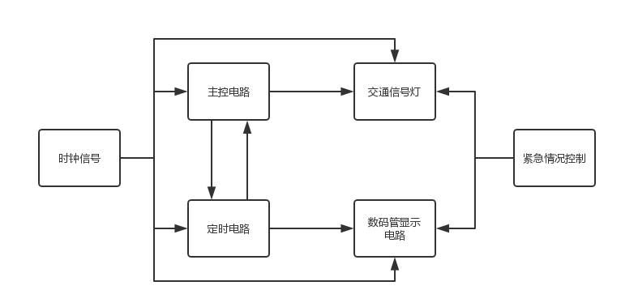
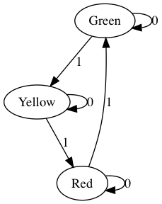
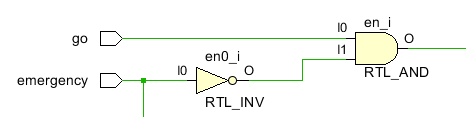
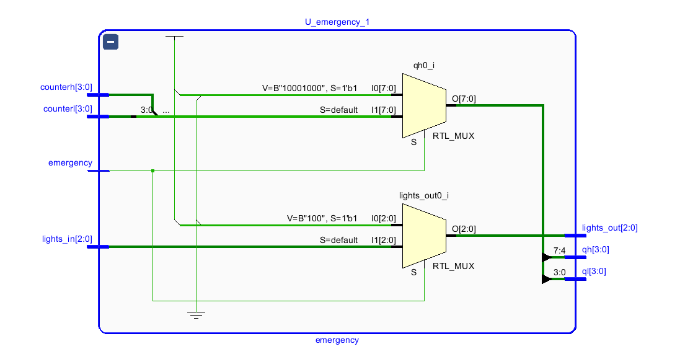
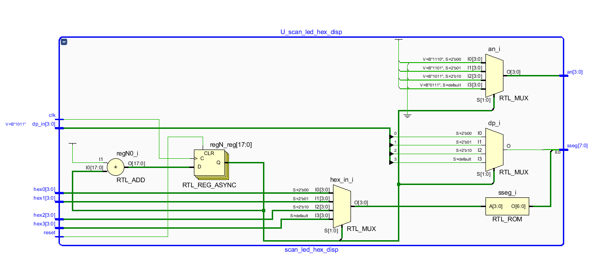
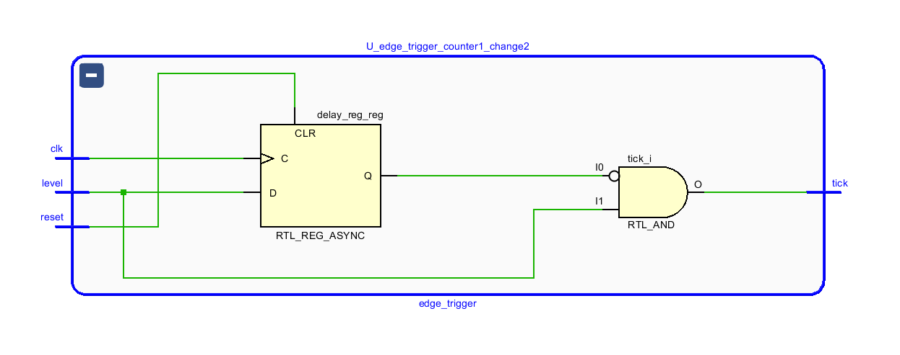
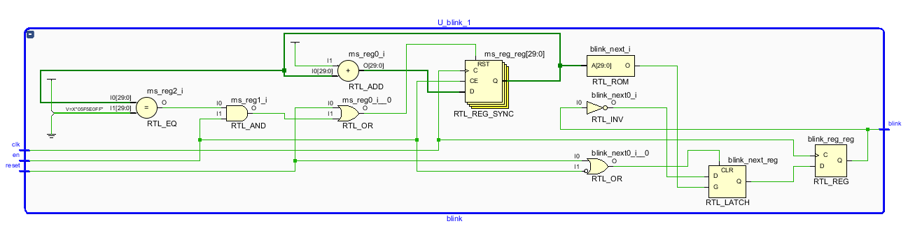
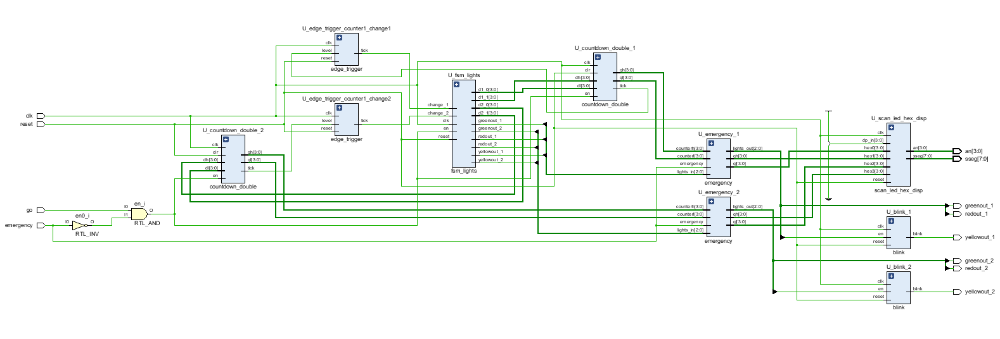

#                           交通灯设计报告

[TOC]

## 一、设计目的

设计一个主副干道十字路口的交通信号灯控制电路，控制指示主副两条交叉道路上的车辆通行。

## 二、系统功能和要求

1. 设东西方向为主干道，南北方向为副干道。东西主干道通行方向通时间设定为 45 秒，南北副干 道通行方向时间为 30 秒；
2. 在两个方向上各设一组红黄绿灯，分别用红、黄、绿发光二极管模拟信号灯；
3. 每次由绿灯变为红灯时，应有 5 秒黄灯亮作为过渡；黄灯亮时，要求每秒钟闪亮一次；
4. 要求黄灯先亮 5 秒，才能变换运行车道；
5. 每个方向各设置一组数码管，以倒计时的方式显示允许通行或禁止通行时间；
6. 每个方向各设置一组数码管，以倒计时的方式显示允许通行或禁止通行时间；
7. 如果发生紧急事件，可以手动控制四个方向红灯全亮。

## 三、系统设计方案

整个交通控制灯电路主要由主控电路、定时电路、时钟信号、显示电路及各模块之间的缓冲电路等部分组成。



> ​                                                                               系统整体框图

### 1. 时钟信号

 时钟信号为BASTS3板上100MHz时钟信号，经分频后作为给个模块的时钟信号；根据同步设计的原则，所有模块均使用同一个时钟，分频后的信号作为使能信号使用；

### 2. 定时电路（countdown_double）

1. 定时电路同步置数，先将时钟信号clk做10000_0000分频得到一秒钟信号，用一秒钟信号作为计数器的使能信号，通过组合逻辑电路输出倒计时时间（两个4位二进制数），当计数到最小值（dh_min,dl_min）时输出一个脉冲信号，然后重新从最大值（dh，dl）开始计数；

2. 因为在东西方向和南北方向的计数时间是不相同的，因此使用两个定时电路分别控制两路的时间；

   ~~~ verilog
   //分频部分
   assign ms_next = (clr||(ms_reg == DVSR && en)) ? 0 :
     										  (en) ? ms_reg + 1 :
     												 ms_reg;
   assign ms_tick = (en)&&(ms_reg == DVSR) ? 1'b1 : 1'b0 //一秒钟信号
   ~~~


### 3. 主控电路（fsm_lights）



> ​                                                                              主控电路状态图

1. 东西方向上默认为绿灯，南北方向上默认为红灯；
2. 每次change发生，灯的状态转换一次，同时输出相应的计时的最大值。

~~~ verilog
//东西方向
always@(*) begin
  time_next_2 = time_reg_2;
  lights_next_2 = lights_reg_2;
  if(reset) begin
    time_next_2 <= time_green_2; //东西方向上默认绿灯
    lights_next_2 <= green; 
  end else if(en) begin
    case(time_reg_2)
      time_red_2 : 
        if(change_2) begin
          time_next_2 = time_green_2;
          lights_next_2 = green;
        end else begin
          time_next_2 = time_red_2;
          lights_next_2 = red;
        end
      time_green_2 : 
        if(change_2) begin
          time_next_2 = time_yellow_2;
          lights_next_2 = yellow;
        end else begin
          time_next_2 = time_green_2;
          lights_next_2 = green;
        end
      time_yellow_2 : 
        if(change_2) begin
          time_next_2 = time_red_2;
          lights_next_2 = red;
        end else begin
          time_next_2 = time_yellow_2;
          lights_next_2 = yellow;
        end
      default : begin
        time_next_2 = time_green_2;
        lights_next_2 = green;
      end
    endcase
  end
end
~~~


### 4. 紧急情况控制（emergency）



---




​	紧急情况控制主要由两部分组成：

 1.  启动/暂停信号（go）和紧急情况信号（emergency）通过组合逻辑构成定时电路（countdown_double）和主控电路（fsm_lights）的使能信号（en）,当出现紧急情况时，定时电路和主控电路暂停；

     ~~~ verilog
     assign en = go && (!emergency);
     ~~~

 2.  紧急情况出现时(``` emergency = 1'b0 ```），通过数据选择器，使交通灯亮红灯，同时数码管显示``` 88 ```;

     ~~~ verilog
     assign {qh,ql} = emergency ? {time_emergency,time_emergency}:{counterh,counterl};
     assign {lights_out} = emergency ? {lights_emergency} : {lights_in};
     ~~~

### 5. 数码管显示电路（scan_led_hex_disp）



1. 输入四个8421BCD码（``` hex3,hex2,hex1,hex0 ```），分别对应四个数码管，前两位为东西方向倒计时时间，后两位为南北方向倒计时时间;

2. 采用动态扫描的方式（扫描频率为``` 100MHZ/2^16 ```），输出一个8位段选信号（``` sseg[7:0] ```）和一个4位位选信号（``` an ```）;

   ~~~ verilog
   //动态扫描
   always @ ( * ) begin
       case (regN[N-1:N-2])
         2'b00: begin an = 4'b1110; hex_in = hex0; dp = dp_in[0]; end
         2'b01: begin an = 4'b1101; hex_in = hex1; dp = dp_in[1]; end
         2'b10: begin an = 4'b1011; hex_in = hex2; dp = dp_in[2]; end
         default: begin an = 4'b0111; hex_in = hex3; dp = dp_in[3]; end
       endcase
   end
   ~~~

   ~~~ verilog
   //数码管编码
   always @ ( * ) begin
       case (hex_in)
           4'h0:sseg[6:0] = 7'b0000001;
           4'h1:sseg[6:0] = 7'b1001111;
           4'h2:sseg[6:0] = 7'b0010010;
           4'h3:sseg[6:0] = 7'b0000110;
           4'h4:sseg[6:0] = 7'b1001100;
           4'h5:sseg[6:0] = 7'b0100100;
           4'h6:sseg[6:0] = 7'b0100000;
           4'h7:sseg[6:0] = 7'b0001111;
           4'h8:sseg[6:0] = 7'b0000000;
           4'h9:sseg[6:0] = 7'b0000100;
           4'ha:sseg[6:0] = 7'b0001000;
           4'hb:sseg[6:0] = 7'b1100000;
           4'hc:sseg[6:0] = 7'b0110001;
           4'hd:sseg[6:0] = 7'b1000010;
           4'he:sseg[6:0] = 7'b0110000; 
         	default: sseg[6:0] = 7'b0111000; //4'hf
       endcase
     	sseg[7] = dp; //小数点
   end
   ~~~

### 6. 缓冲电路（上升沿检测 edge_trigger）

当定时电路倒计时结束时会输出一个脉冲信号``` tick ```,但这个信号宽度为1s，如果直接作为下一级（主控电路）的使能信号，由于主控电路的时钟频率为100MHz，电路在1s时间里持续使能，电路的状态会不停改变，不和预期要求，因此加入上升沿检测电路，检测到上升沿后输出一个时钟周期的高电平脉冲，作为主控电路的使能信号。



上升沿检测电路由一个D触发器和一个与门构成：

~~~ verilog
always@(posedge clk,posedge reset) begin
  if(reset) begin
    delay_reg <= 1'b0;
  end else begin
    delay_reg <= level;
  end
end
assign tick = ~delay_reg & level;
~~~

### 7. 黄灯闪烁电路（blink）



主控电路输出的黄灯信号作为该电路的使能信号，输出一个周期为1s，占空比50%的信号，接到交通灯🚥的黄灯上，使黄灯可以每隔一秒钟闪烁一次；

## 四、小结

## 五、整体电路



